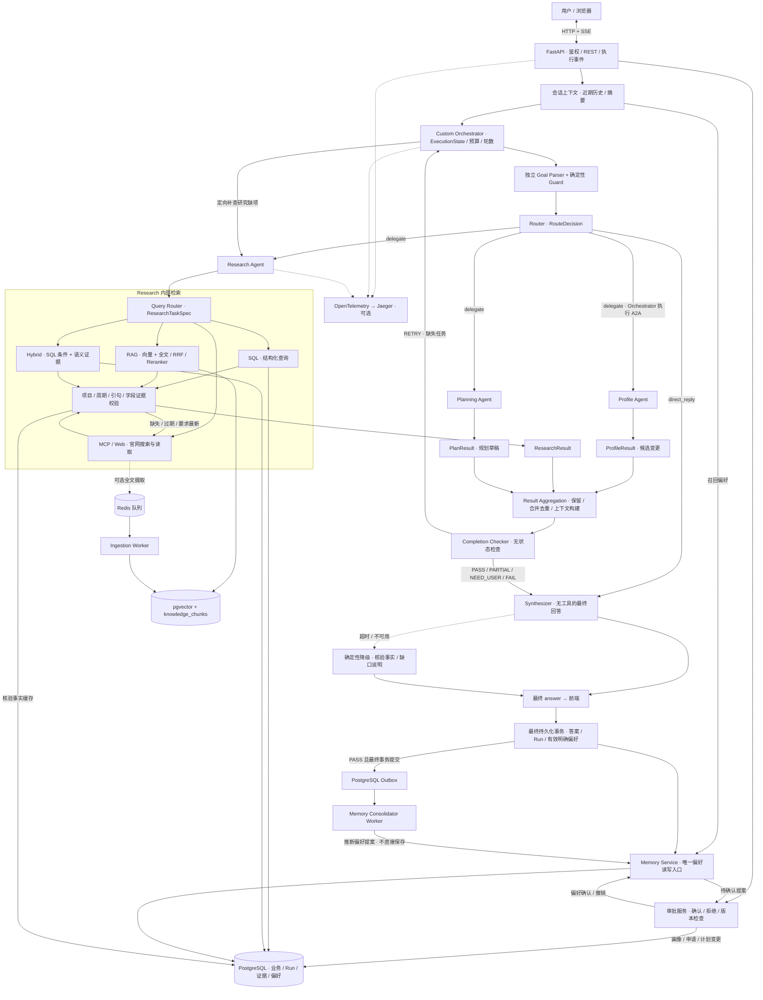

# Opportunity Agent · V2

面向留学申请的多智能体助手：维护申请画像、核查学校官网信息、生成申请规划，并保留可追踪的执行、证据和审批记录。

**Custom Python Orchestrator · openJiuwen A2A · PostgreSQL / pgvector · RAG · MCP · 偏好记忆 · 独立 Synthesizer**

Router 只选择执行路径，领域 Agent 返回结构化结果，Synthesizer 负责最终回答。系统不以模型记忆替代官网证据：未核实的信息保持未知，未完成的查询如实返回缺口。

> 当前为开发原型，不是已完成质量验收的选校服务。链路连通、证据校验和真实检索质量是三个不同层次。

## 核心能力

- **Profile**：提取背景、成绩、申请状态与偏好候选；画像和业务变更经审批、冲突及版本检查后生效。
- **Research**：查询 GRE、截止日期、语言要求、课程和研究方向；内部选择 SQL、RAG、Hybrid 或 MCP / Web。
- **Planning**：结合画像与研究结果生成申请时间线、任务和规划草稿。
- **偏好记忆**：跨会话召回相关偏好；明确偏好经规则验证后保存，推断偏好等待确认，支持撤销。
- **定向修复**：保留合格结果，仅补查缺项，去重合并后重新检查。
- **可观测与容错**：REST / SSE、持久化事件、Run / Trace 标识、可选 Jaeger，以及合成失败后的确定性回复。

## V1 与 V2

| | V1 | V2（本文重点） |
|---|---|---|
| 定位 | 本机画像、路线图 Demo | 带鉴权、可追踪的多 Agent 申请助手 |
| 编排 | ReAct 聊天 Agent 调用 Opportunity A2A | 自定义 Orchestrator；Router 只路由，Synthesizer 回答 |
| 领域能力 | 画像、时间轴、本地模拟岗位匹配 | Profile / Research / Planning 独立 A2A 服务 |
| 存储 | `data/conversations.json` | PostgreSQL 业务与记忆、pgvector 检索、Redis 队列 |
| 检索 | 可选官网工具 | SQL / RAG / Hybrid / MCP，字段级证据与核验事实缓存 |
| 前端 | `http://127.0.0.1:8766`，无登录 | `http://127.0.0.1:8000/v2`，Cookie / JWT 用户隔离 |

V1 继续保留，部分画像、规划逻辑由 V2 复用；**V1 的 `data/conversations.json` 迁移仍暂缓**。原有运行说明已保留在 [V1 README](docs/v1_readme.md)。

## 架构

按当前代码更新参考图：主控制流不是 LangGraph / ReAct 自主循环；默认 Docker 配置使用 openJiuwen **Python A2A**。下图可在 GitHub 直接渲染。



图中是逻辑调用关系，不代表领域 Agent 互相调度。RETRY 由 Orchestrator 根据 `missing_tasks` 定向执行，也可补调 Profile 或 Planning。**Checker 不保存结果**，结果由 `ExecutionState` 持有；PARTIAL 等终态可以生成说明，但不代表请求达标。

可单独复用的架构图源文件：[architecture-v2.mmd](docs/architecture-v2.mmd)。

### 两层路由

| 层级 | 职责 | 输出 |
|---|---|---|
| Router | 找哪个 Agent，还是只需闲聊回复？ | `RouteDecision`：mode、agents、parallel、reason、resolved_query |
| Research Query Router | Research 内部找哪种知识？ | `sql / rag / hybrid / mcp_web` |

- **SQL**：参数化查询 PostgreSQL 项目和字段事实，不是在网页原文上执行 SQL。已有文档或 `pending_review` 字段不等于已核验政策。
- **RAG**：multilingual E5 向量与全文召回，经 RRF 融合、BGE Cross-Encoder 重排。语义相关不等于 GRE、日期已经证实。
- **Hybrid**：结构化条件与课程／研究语义证据组合；不同于 RAG 内部的向量／全文融合。
- **MCP / Web**：Tavily 搜索和受控官网读取；缺失、过期或要求最新时可触发，不保证每次都找到有效证据。

在线核验通过的结构化事实默认同步写入缓存；有效期内普通查询可直接走 SQL。全文／向量摄取是独立可选流程，旧待审核记录不会自动提升为可信数据。

## 快速开始：Docker

从包含 `docker-compose.yml` 的项目目录执行。需要 Docker Desktop（Linux containers），容器能访问镜像仓库和模型服务；完整 RAG 还需下载 Hugging Face 模型。

### 1. 配置 `.env`

仅在没有 `.env` 时复制，避免覆盖已有配置：

```powershell
if (!(Test-Path .env)) { Copy-Item .env.example .env }
notepad .env
```

填写下列变量。模型服务须支持 OpenAI 兼容 Chat Completions；占位值不能用于运行：

```dotenv
JWT_SECRET=<你生成的至少32字符随机密钥>
LLM_API_KEY=<你的模型密钥>
LLM_API_BASE=<模型服务地址，例如 https://your-provider.example/v1>
LLM_MODEL=<服务支持的模型名称>

# 官网搜索可选；不配置就不能使用在线 MCP 补查
TAVILY_API_KEY=<你的Tavily密钥>
RESEARCH_WEB_ENABLED=1
```

用 PowerShell 生成 JWT 密钥，再自行填入 `.env`；不要提交密钥或 `.env`：

```powershell
$jwtBytes = New-Object byte[] 48
$jwtRng = [System.Security.Cryptography.RandomNumberGenerator]::Create()
$jwtRng.GetBytes($jwtBytes)
[Convert]::ToBase64String($jwtBytes)
$jwtRng.Dispose()
```

### 2. 选择运行方式

**基础模式**：画像、规划、SQL 和 MCP 功能验证；基础镜像未安装完整 RAG 模型依赖。

```powershell
docker compose up -d --build
docker compose ps
docker compose logs -f api research worker
```

**完整 CPU 检索**：安装 embedding / reranker 依赖并预热模型，首次启动可能较慢。

```powershell
docker compose -f docker-compose.yml -f docker-compose.research.cpu.yml up -d --build
```

**NVIDIA GPU 检索 + Jaeger**：需要 Docker GPU 支持，不与 CPU overlay 同时启用。

```powershell
docker compose -f docker-compose.yml -f docker-compose.research.yml up -d --build
```

后续 `ps / logs / exec` 沿用所选的 `-f` 参数。API 启动时执行 Alembic 迁移，升级已有数据库前先备份。RAG 校准文件需来自人工 dev 标注，详见 [Research 运行与评测](docs/research_agent.md)。

### 3. 从前端体验

1. 打开 [V2 前端](http://127.0.0.1:8000/v2)，注册并登录测试账号。
2. 新建对话，发送下方样例；查看执行步骤、回复和 Run / Trace 标识。
3. 核对并接受待确认的画像／规划变更；在“偏好”页查看和撤销已保存偏好。
4. [FastAPI Docs](http://127.0.0.1:8000/docs) 提供接口说明，健康检查为 `/healthz`。
5. GPU / OTel overlay 提供 [Jaeger](http://127.0.0.1:16686)，按 Trace ID 查看跨服务调用。

Docker 模式**不需要宿主机再 pip 安装或执行 `run_v2_local.ps1`**。后者是 SQLite 本地开发入口，不是完整 Docker / pgvector 链路。

当前 API 端口映射为 `8000:8000`，不应视为仅本机可访问。本机演示可改为 `127.0.0.1:8000:8000`；默认数据库口令和 HTTP 配置不适合直接上线公网。`docker compose down` 可停止服务；不要随意使用 `down -v`，它会删除持久数据卷。

## 运行样例：输入 → 路径 → 回复

以下按当前代码和受控链路用例整理，**均为交互示意，不是本次重新执行的真实模型记录**。不承诺完全相同的措辞；政策、日期和课程必须由当次有效官网证据支持。

所有 delegate 路径最终均经过：`结构化结果 → Result Aggregation → Completion Checker → Synthesizer → 前端`。

### 1. 更新画像

**用户：**「我的 GPA 是 3.7。」

**路径：**`Guard / Router → Profile → 汇总检查 → Synthesizer → 待确认变更`

**回复示意：**「已识别 GPA 3.7 的资料变更候选，请在待确认列表核对后接受；确认前不会修改正式画像。」

### 2. 截止日期：SQL，必要时 MCP

**用户：**「查询 CMU MSAII 2027 Fall 的申请截止日期。」

**路径：**`Router → Research → Query Router(sql) → PostgreSQL → 缺项时 MCP / Web → 字段证据校验 → 汇总检查 → Synthesizer`

**回复示意：**「已核实该项目 2027 Fall 的截止日期为〈官网支持的日期〉，来源：〈官方申请页链接〉。」不能核验时明确说明缺项，不猜测日期。缓存成功后，有效期内普通重复查询可直接走 SQL。

### 3. 课程：RAG

**用户：**「查询 CMU MSCS 2027 Fall 的机器学习课程。」

**路径：**`Router → Research → Query Router(rag) → 向量 / 全文召回 → RRF → Reranker → 证据校验 → 汇总检查 → Synthesizer`

**回复示意：**「根据〈课程官网〉，可核实的相关课程包括〈课程条目〉……未确认该入学季适用的内容单独标注。」没有校准阈值或有效证据时，不凭相似度声称质量达标。

### 4. 政策 + 方向：Hybrid

**用户：**「查询 CMU MSCS 2027 Fall 的 GRE 和 AI 课程。」

**路径：**`Router → Research → Query Router(hybrid) → SQL 政策事实 + RAG 课程证据 → 汇总检查 → Synthesizer`

**回复示意：**「GRE：〈已核验政策及来源〉。AI 课程：〈有引用支持的信息〉。未核实字段：〈缺项〉。」

### 5. 要求最新：MCP / Web

**用户：**「查询 CMU MSCS 2027 Fall 最新官网截止日期和 GRE。」

**路径：**`Router → Research → Query Router(mcp_web) → Tavily MCP → 官网读取 → 项目 / 周期 / 引句 / 字段校验 → 汇总检查 → Synthesizer`

**回复示意：**「本次在线核验结果如下……〈逐字段结论与官方来源〉。」搜索命中但正文不能证明项目和周期时，仍返回未核实。

### 6. 三 Agent 协作

**用户：**「我的 GPA 是 3.7，查询 CMU MSCS 2027 Fall 的 GRE 和 AI 课程，并为我制定申请规划。」

**路径：**`Guard / Router → Profile + Research(hybrid) + Planning → 合并三类结果 → Checker → Synthesizer`

**回复示意：**「GPA 更新已生成待确认候选；政策与课程见引用；申请规划草稿已生成，请核对时间线和待办。」并行与否由依赖关系决定，不能假定三个 Agent 总是并行。

### 7. 偏好与闲聊

**用户：**「我不考虑需要 GRE 的项目。」

**路径：**`偏好识别 / Profile 候选 → 本轮条件 → 最终事务由 Memory Service 验证保存 → memory_updated`

**回复示意：**「后续查询会考虑排除 GRE 必交项目的偏好。」保存结果以 `memory_updated` 和偏好列表为准，不能只看模型口头承诺。

**用户：**「你好，谢谢你。」

**路径：**`Router(direct_reply, agents=[]) → Synthesizer → 前端`

**回复示意：**「不客气，有需要随时告诉我。」不调用三个领域 Agent，不触发长期记忆归纳。

### 8. 缺项补查与合成降级

**用户：**「找 5 个 2027 Fall 不强制 GRE、方向与 AI 相关的美国计算机硕士项目，列出截止日期。」

**路径示意：**`首轮 4 个合格 → Checker RETRY（缺 1）→ Orchestrator 保留 4 个 → Research 定向补查 → 合并去重 → 再检查`

达标时生成完整回答；补查无效或预算耗尽时输出已有结果和缺口，例如：「目前核实了 4 个，尚缺 1 个满足全部条件且证据充分的项目，不将未核实项目计入。」

若最终模型合成超时，触发 `synthesizer_fallback`，以确定性文本返回核验事实和缺口。这不保证上游模型、鉴权或基础设施故障都能完成业务请求。

## 调试与测试

消息 ID、Run ID、Trace ID 不同。登录后使用：

```text
POST /api/v1/conversations/{conversation_id}/runs
  {"message":"查询 CMU MSAII 2027 Fall 的截止日期", "request_id":"unique-request-id"}
  → {"run_id":"...", "status":"queued"}

GET /api/v1/conversations/{conversation_id}/runs
GET /api/v1/runs/{run_id}
GET /api/v1/runs/{run_id}/events
```

使用同一主机名登录和访问接口，不混用 `localhost` 与 `127.0.0.1` 的 Cookie。命令行需保留登录 Cookie 或携带 Bearer Token，否则返回 `authentication required`。

重点事件：`route_selected`、`agent_started/completed/failed`、`completion_checked`、`repair_round_started`、`synthesizer_diagnostics/fallback`、`memory_updated`、`run_completed/failed`。Run `completed` 表示执行结束，业务完成度还要看 `completion.status`。

离线开发测试在宿主机安装依赖，与 Docker 运行方式分开：

```powershell
python -m venv .venv
.\.venv\Scripts\Activate.ps1
python -m pip install -e ".[dev,v2,resume]"
python -m pytest tests/test_v2_full_chain.py tests/test_v2_memory.py tests/test_v2_synthesis_cache.py -q
```

全量 V2 回归：`python -m pytest tests -k v2 -q`。受控链路测试覆盖 HTTP / SSE、三个 Python A2A 服务、四种 Research 路径、汇总与合成；模型文本、外部网页及部分检索分数是测试替身，**不能据此声称真实 RAG Precision / Recall 很高**。

测试方法与诊断入口见 [Research 文档](docs/research_agent.md) 和 [合成容错与缓存说明](docs/synthesis_cache_reliability.md)。本地历史报告不随本次文档提交发布，也不代表当前 checkout 的实时测试结果；真实双查询验收曾因模型网关认证失败而未完成。

## 当前边界与后续验收

- 已实现偏好读写、归纳提案和审批；不自动将学校事实、规划建议、执行经验保存为用户长期记忆。
- 预算偏好不代表已支持可靠的年度总费用硬过滤；费用范围、币种、生活费等需单独补齐、验收。
- 未指定年份默认 **2027**，不默认学期；这是固定默认值，不随日历自动滚动。
- Router 仍有启发式当前查询保护和有限历史窗口；通用带来源的 Context Resolver 尚未实现，多轮条件继承需要完善。
- 当前 PASS 后即使使用合成降级回复，也可能提交归纳任务；“模型合成成功才归纳”的更严格门槛仍需补齐。
- SSE 提供执行进度及最终答案，**不是逐 token 回复**。
- 未加入在线评估 Agent / Answer Validator；Checker PASS 不是答案正确率证明。
- 人工 gold 完成后单独验收 Precision@5、Recall@5、MRR、无答案表现和引用支持；真实模型、浏览器及部署需分层验收。
- 外部模型、工具可能接收请求内容，不要在公开演示账号输入敏感资料。Research A2A 请求不携带完整画像或会话原文。

## 代码导航

| 目录 / 文件 | 用途 |
|---|---|
| `opportunity_agent/v2/api/`、`v2/web/` | 鉴权 API、SSE、前端 |
| `v2/agents/orchestrator.py` | Goal Parser、Router、控制循环、Synthesizer |
| `v2/agents/a2a.py`、`contracts.py` | openJiuwen A2A 与结构化契约 |
| `v2/agents/result_aggregation.py`、`orchestrator.py` | 汇总、Completion Checker 与缺项修复 |
| `v2/research/`、`v2/rag/` | 四路检索、官网核验、缓存、向量与重排 |
| `v2/services/` | 会话、偏好、归纳、审批和业务服务 |
| `v2/db/`、`alembic/` | 数据模型与增量迁移 |
| `v2/evaluation/`、`tests/` | 离线评测与回归测试 |

进一步阅读：[Research](docs/research_agent.md) · [偏好记忆](docs/v2_preference_memory.md) · [合成容错与事实缓存](docs/synthesis_cache_reliability.md) · [前端与规划](docs/v2_profile_planning_frontend.md) · [简历导入](docs/resume_import.md)。
